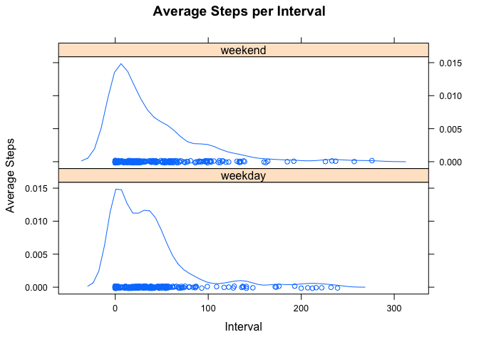

# Reproducible Research: Peer Assessment 1


## Loading and preprocessing the data

#### Download

```r
if (!file.exists("activity.zip")) {
  download.file(url="https://d396qusza40orc.cloudfront.net/repdata%2Fdata%2Factivity.zip",
               method="curl", destfile="activity.zip")
}
```

#### Unarchive

```r
if (!file.exists("activity.csv")) {
  unzip("activity.zip")
}
```

#### Load file

```r
if(!exists("activity")){
  activity <- read.csv("activity.csv")
}
library(sqldf)
```

```
## Loading required package: gsubfn
## Loading required package: proto
## Loading required package: RSQLite
## Loading required package: DBI
```


## What is mean total number of steps taken per day?

#### Daily Activity

```r
daily_activity<-sqldf("select sum(steps) as steps, date from activity group by date")
```

```
## Loading required package: tcltk
```

```r
hist(daily_activity[["steps"]], breaks=20, xlab="Number of Steps", main="Daily Activity")
```

 


```r
mean_steps_per_day <- mean(daily_activity[["steps"]],na.rm=TRUE)
median_steps_per_day <- median(daily_activity[["steps"]],na.rm=TRUE)
```

There was a mean of 1.0766189\times 10^{4} steps taken per day.
There was a median of 10765 steps taken per day.


### What is the average daily activity pattern?

1. Make a time series plot (i.e. `type = "l"`) of the 5-minute interval (x-axis) and the average number of steps taken, averaged across all days (y-axis)


```r
interval_activity<-sqldf("select sum(steps) as steps, interval from activity group by interval")
with(interval_activity,{plot(interval,steps,type="l",ylab="Steps",xlab="Interval", main="Steps per Interval")})
```

 

2. Which 5-minute interval, on average across all the days in the dataset, contains the maximum number of steps?


```r
sqldf("select interval from interval_activity where steps =(select max(steps) from interval_activity)")
```

```
##   interval
## 1      835
```

### Imputing missing values

1. Calculate and report the total number of missing values in the dataset (i.e. the total number of rows with `NA`s)

```r
sum(is.na(activity[["steps"]]))
```

```
## [1] 2304
```

2. Devise a strategy for filling in all of the missing values in the dataset. The strategy does not need to be sophisticated. For example, you could use the mean/median for that day, or the mean for that 5-minute interval, etc.

To check which times and days have missing values, let's see how many values are missing per day:

```r
sqldf("select date, count(date) from activity where steps is null group by date")
```

```
##         date count(date)
## 1 2012-10-01         288
## 2 2012-10-08         288
## 3 2012-11-01         288
## 4 2012-11-04         288
## 5 2012-11-09         288
## 6 2012-11-10         288
## 7 2012-11-14         288
## 8 2012-11-30         288
```

This shows that the null values are entire days for which the data is missing.

3. Create a new dataset that is equal to the original dataset but with the missing data filled in.

Adding data from an average day for these missing values. First, let's create a table with just the steps and intervals on the median day:

```r
median_steps_per_day <- median(daily_activity[["steps"]],na.rm=TRUE)
median_day_steps <- sqldf(paste0("select steps, interval from activity where date=(select date from daily_activity where steps=", median_steps_per_day,")"))
# median_day_steps <- sqldf(paste0("select steps, interval from activity where date=(select date from daily_activity where steps=",10765,")"))
```

Next, let's substitute null values for these ones

```r
empty_dates<-sqldf("select distinct date from activity where steps is null")
median_dates<-sqldf("select steps, date, interval from empty_dates, median_day_steps")
full_activity<-rbind(sqldf("select * from activity where steps is not null"),median_dates)
```

4. Make a histogram of the total number of steps taken each day and Calculate and report the **mean** and **median** total number of steps taken per day. Do these values differ from the estimates from the first part of the assignment? What is the impact of imputing missing data on the estimates of the total daily number of steps?

#### Histogram of the total number of steps taken each day

```r
full_daily_activity<-sqldf("select sum(steps) as steps, date from full_activity group by date")
hist(full_daily_activity[["steps"]], breaks=20, xlab="Number of Steps", main="Daily Activity")
```

 


```r
mean_steps_per_day <- mean(daily_activity[["steps"]],na.rm=TRUE)
median_steps_per_day <- median(daily_activity[["steps"]],na.rm=TRUE)
```

There was a mean of 1.0766189\times 10^{4} steps taken per day.
There was a median of 10765 steps taken per day.

####Do these values differ from the estimates from the first part of the assignment?
No

####What is the impact of imputing missing data on the estimates of the total daily number of steps?
No impact of daily values since missing data was chosen to be consistent for daily calculations.

## Are there differences in activity patterns between weekdays and weekends?
Since the average day is repeated, there is a higher frequency of the median value.
####Using the lubridate library for weekdays

```r
#install.packages("lubridate")
library(lubridate)
```

####Adding weekdays and add as a column and creating a new dataset

```r
weekdaymap<-c("weekend","weekday","weekday","weekday","weekday","weekday","weekend")
full_activity$weekday <- weekdaymap[wday(as.Date(activity$date))]
```

####Plotting the data.

```r
wd<-sqldf("select interval, sum(steps)/count(weekday) as average_steps, weekday from full_activity group by weekday, interval")

library(lattice)

with(wd,{densityplot(interval~average_steps|weekday,
xlab="Interval", ylab="Average Steps",
main="Average Steps per Interval",
layout=c(1,2))})
```

 

There are differences between the activity patterns of weekdays and weekends. Also the added values represent a single day, so adding this data makes the weekends and weekdays appear more similar. 
